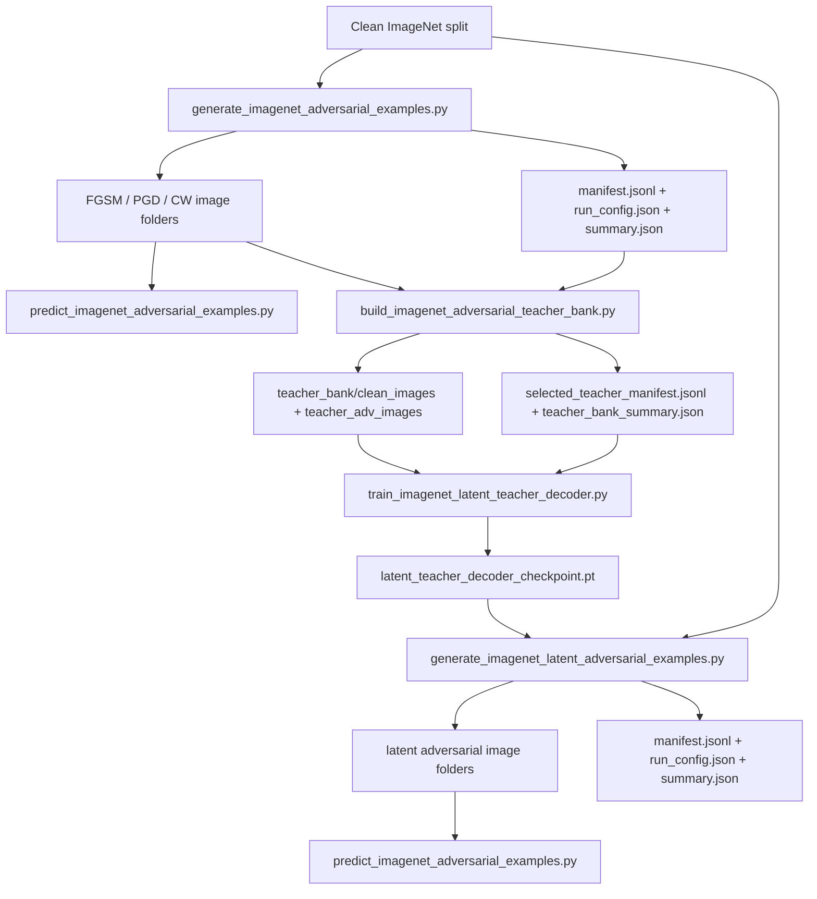

# LLR2 `tool_adversarial` Workflow

This note is for another AI or engineer who needs to understand the workflow in `/home/tyd/git/LLR2/tool_adversarial` quickly.

The folder implements two related pipelines:

1. A baseline attack pipeline that generates and evaluates `FGSM`, `PGD`, and `CW` adversarial examples.
2. A latent-decoder pipeline that distills those baseline attacks into a learned perturbation space, then generates new attacks by optimizing latent codes.

## Current Example Run

The manifests and summaries currently in this folder show a concrete run with:

- dataset: `imagenet1k`
- split: `val`
- model: `vit_b_32`
- classifier source: torchvision pretrained weights
- preset: `0`
- batch size: `16`
- workers: `4`
- attack mode: untargeted
- `epsilon`: `8/255 = 0.031372549...`

Observed baseline results from `/home/tyd/git/LLR2/tool_adversarial/imagenet1k_adversarial/summary.json`:

| attack | attempted | success | success_rate |
|---|---:|---:|---:|
| `fgsm` | 37956 | 27682 | 0.7293 |
| `pgd` | 37956 | 37943 | 0.9997 |
| `cw` | 37956 | 37953 | 0.9999 |

Observed latent-decoder result from `/home/tyd/git/LLR2/tool_adversarial/imagenet1k_latent_adversarial/summary.json`:

| attack | attempted | success | success_rate |
|---|---:|---:|---:|
| `latent_decoder` | 37956 | 35332 | 0.9309 |

Both runs processed `50000` validation images, with `37956` eligible and `12044` skipped because the clean classifier already misclassified them.

## End-to-End Flow



## Script Roles

### 1. `generate_imagenet_adversarial_examples.py`

Purpose:
- Generate standard adversarial examples directly in pixel space.
- Supports `FGSM`, `PGD`, and `CW`.

Inputs:
- clean ImageNet dataset from the LLR2 dataset API
- classifier checkpoint or torchvision pretrained classifier

Outputs:
- attack folders like:
  - `fgsm/class_0000/...png`
  - `pgd/class_0000/...png`
  - `cw/class_0000/...png`
- root metadata files:
  - `manifest.jsonl`
  - `run_config.json`
  - `summary.json`

Important behavior:
- By default it attacks only cleanly classified samples.
- `eligible` means the sample is attacked.
- `skipped` means the classifier already got the clean image wrong, so the script ignores it unless `--attack-all-samples` is used.

Sample command matching the current baseline run:

```bash
python3 /home/tyd/git/LLR2/tool_adversarial/generate_imagenet_adversarial_examples.py \
  --model-type vit_b_32 \
  --use-torchvision-pretrained \
  --output-dir /home/tyd/git/LLR2/tool_adversarial/imagenet1k_adversarial \
  --attacks fgsm pgd cw \
  --split val \
  --batch-size 16 \
  --num-workers 4 \
  --epsilon 0.03137254901960784 \
  --pgd-alpha 0.00784313725490196 \
  --pgd-steps 10 \
  --cw-steps 200 \
  --cw-lr 0.01
```

### 2. `predict_imagenet_adversarial_examples.py`

Purpose:
- Re-run a classifier on a saved image folder and compute attack success rates.
- Works for both baseline outputs and latent-decoder outputs.

How labels are inferred:
- `manifest.jsonl` if present
- otherwise folder names like `class_0005`
- targeted labels from file names like `*_target_0017.png`

Outputs:
- `prediction_results.jsonl`
- `prediction_summary.json`

Sample command for the baseline folder:

```bash
python3 /home/tyd/git/LLR2/tool_adversarial/predict_imagenet_adversarial_examples.py \
  /home/tyd/git/LLR2/tool_adversarial/imagenet1k_adversarial \
  --model-type vit_b_32 \
  --use-torchvision-pretrained
```

Sample command for the latent-decoder folder:

```bash
python3 /home/tyd/git/LLR2/tool_adversarial/predict_imagenet_adversarial_examples.py \
  /home/tyd/git/LLR2/tool_adversarial/imagenet1k_latent_adversarial \
  --model-type vit_b_32 \
  --use-torchvision-pretrained
```

### 3. `build_imagenet_adversarial_teacher_bank.py`

Purpose:
- Convert the saved baseline attack outputs into a teacher bank for latent-model training.
- For each source image, choose one teacher attack example.

Inputs:
- adversarial root from step 1
- `manifest.jsonl` from step 1
- saved attack image files from step 1

Outputs under `teacher_bank/`:
- `clean_images/<split>/class_xxxx/source_XXXXXXXX.png`
- `teacher_adv_images/<split>/class_xxxx/<stem>.png`
- `selected_teacher_manifest.jsonl`
- `teacher_bank_summary.json`

Important note:
- This step requires the actual saved adversarial image files, not only the manifest.

Sample command:

```bash
python3 /home/tyd/git/LLR2/tool_adversarial/build_imagenet_adversarial_teacher_bank.py \
  /home/tyd/git/LLR2/tool_adversarial/imagenet1k_adversarial \
  --model-type vit_b_32 \
  --use-torchvision-pretrained \
  --selection-mode untargeted \
  --split val
```

### 4. `train_imagenet_latent_teacher_decoder.py`

Purpose:
- Train the learned perturbation model from the teacher bank.
- Learns:
  - one shared `LatentGridDecoder`
  - one training latent code per teacher-bank sample

Input:
- `teacher_bank/` from step 3

Outputs under `teacher_bank/latent_decoder/` by default:
- `train_config.json`
- `latent_teacher_decoder_checkpoint.pt`
- `latent_teacher_decoder_report.json`

The current latent run used a decoder config of:
- `grid_size = 20`
- `latent_channels = 3`
- `hidden_channels = 24`
- `scale = 0.9803920984268188`

Sample command consistent with the current latent checkpoint:

```bash
python3 /home/tyd/git/LLR2/tool_adversarial/train_imagenet_latent_teacher_decoder.py \
  /home/tyd/git/LLR2/tool_adversarial/imagenet1k_adversarial/teacher_bank \
  --model-type vit_b_32 \
  --use-torchvision-pretrained \
  --epochs 10 \
  --batch-size 32 \
  --num-workers 4 \
  --grid-size 20 \
  --latent-channels 3 \
  --hidden-channels 24
```

### 5. `generate_imagenet_latent_adversarial_examples.py`

Purpose:
- Use the trained latent decoder to attack new clean images by optimizing a fresh latent code per image or per batch.

Inputs:
- `latent_teacher_decoder_checkpoint.pt`
- clean ImageNet split
- classifier checkpoint or torchvision pretrained classifier

Outputs:
- latent attack folder, by default:
  - `latent_decoder/class_0000/...png`
- optional clean image folder:
  - `clean/class_0000/...png`
- root metadata files:
  - `manifest.jsonl`
  - `run_config.json`
  - `summary.json`

Sample command matching the current latent run:

```bash
python3 /home/tyd/git/LLR2/tool_adversarial/generate_imagenet_latent_adversarial_examples.py \
  /home/tyd/git/LLR2/tool_adversarial/imagenet1k_adversarial/teacher_bank/latent_decoder/latent_teacher_decoder_checkpoint.pt \
  --model-type vit_b_32 \
  --use-torchvision-pretrained \
  --output-dir /home/tyd/git/LLR2/tool_adversarial/imagenet1k_latent_adversarial \
  --split val \
  --batch-size 16 \
  --num-workers 4 \
  --steps 80 \
  --lr 0.08 \
  --epsilon 0.031372549 \
  --save-originals
```

### 6. `predict_imagenet_adversarial_examples.py` again

Use the same evaluator from step 2 to score the latent-decoder outputs from step 5.

## Manifest Semantics

Baseline `manifest.jsonl` rows look like:

```json
{
  "attack": "fgsm",
  "split": "val",
  "source_index": 1,
  "source_path": ".../ILSVRC2012_val_00002138.JPEG",
  "label": 0,
  "clean_pred": 0,
  "adv_pred": 395,
  "clean_correct": true,
  "success": true,
  "targeted": false,
  "target_label": null,
  "pixel_l2": 12.113380432128906,
  "pixel_linf": 0.031372666358947754,
  "saved_path": ".../fgsm/class_0000/00000001_ILSVRC2012_val_00002138.png"
}
```

Latent-decoder `manifest.jsonl` rows add confidence and decoder-specific fields:

```json
{
  "attack": "latent_decoder",
  "split": "val",
  "source_index": 1,
  "source_path": ".../ILSVRC2012_val_00002138.JPEG",
  "label": 0,
  "clean_pred": 0,
  "adv_pred": 389,
  "clean_correct": true,
  "success": true,
  "targeted": false,
  "target_label": null,
  "pixel_l2": 3.8848540782928467,
  "pixel_linf": 0.031372666358947754,
  "saved_path": ".../latent_decoder/class_0000/00000001_ILSVRC2012_val_00002138.png",
  "source_confidence": 6.879876309540123e-05,
  "target_confidence": null,
  "decoded_delta_rms": 0.05178039148449898
}
```

## Concepts Another AI Should Know

- `untargeted` attack:
  - success means the model prediction changes away from the true source label
- `targeted` attack:
  - success means the model prediction becomes one specific chosen target label
- `FGSM`:
  - one-step gradient-sign attack
- `PGD`:
  - multi-step projected gradient attack, stronger than FGSM
- `CW`:
  - slower optimization-based attack, often very strong and low-distortion

## Practical Caveats

- If only `manifest.jsonl` remains but the saved adversarial image folders are gone, `build_imagenet_adversarial_teacher_bank.py` cannot rebuild the teacher bank by itself.
- By default, both generation scripts attack only cleanly classified samples. This is why `eligible` and `skipped` appear in progress logs.
- The latent-decoder pipeline is downstream of the baseline pipeline:
  - no baseline images
  - no teacher bank
  - no latent decoder training
  - no latent-decoder attack generation

## Recommended Reading Order

If another AI needs to inspect code quickly, read the files in this order:

1. `/home/tyd/git/LLR2/tool_adversarial/generate_imagenet_adversarial_examples.py`
2. `/home/tyd/git/LLR2/tool_adversarial/build_imagenet_adversarial_teacher_bank.py`
3. `/home/tyd/git/LLR2/tool_adversarial/train_imagenet_latent_teacher_decoder.py`
4. `/home/tyd/git/LLR2/tool_adversarial/generate_imagenet_latent_adversarial_examples.py`
5. `/home/tyd/git/LLR2/tool_adversarial/predict_imagenet_adversarial_examples.py`

